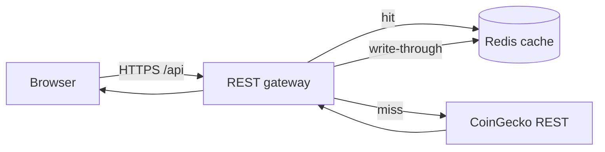
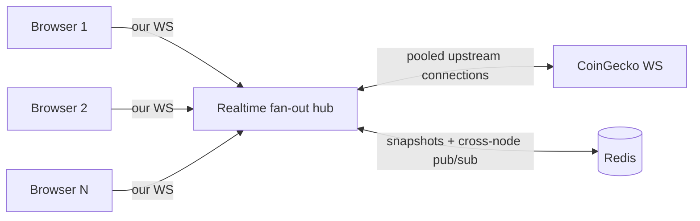

# 1. Backend-for-Frontend for market data

- **Status:** Accepted
- **Date:** 2026-06-05
- **Tier:** Tier 2 of the enterprise roadmap (toward a public, multi-tenant SaaS)

## Context

CryptoPulse talks to CoinGecko from two places today:

- **REST** — server-side, via `lib/coingecko.actions.ts` (`fetcher`). The Pro key
  (`COINGECKO_API_KEY`) stays on the server. This part is already sound.
- **WebSocket** — **directly from the browser**, via `hooks/useCoinGeckoWebSocket.ts`,
  using `NEXT_PUBLIC_COINGECKO_WEBSOCKET_URL` and `NEXT_PUBLIC_COINGECKO_API_KEY`.

For a public SaaS, the WebSocket path has four blocking problems:

1. **The realtime API key ships to every browser.** Anything prefixed `NEXT_PUBLIC_` is
   inlined into the client bundle. Anyone can read it and spend our paid quota.
2. **Upstream connections scale with users, not with data.** Each browser opens its own
   CoinGecko socket and subscribes independently. 10,000 concurrent users means ~10,000
   upstream connections — past plan limits and impossible to govern.
3. **No cross-user caching or coalescing.** Identical REST calls (e.g. `/coins/markets`
   page 1) and identical streams are paid for once _per user_ instead of once _per TTL
   window_. Next's per-route fetch cache helps REST but does nothing for the stream.
4. **No per-tenant rate limiting, quotas, or abuse protection**, and the app is
   hard-coupled to a single provider (a single point of failure).

## Decision

Introduce a **Backend-for-Frontend (BFF)**: the browser talks **only** to our own API and
our own realtime endpoint. Our servers become the _sole_ client of CoinGecko. The
`NEXT_PUBLIC_COINGECKO_*` variables are deleted.

The BFF has five parts:

1. **REST gateway** — server route handlers / actions that proxy CoinGecko REST behind a
   shared cache. One upstream call per endpoint+params per TTL window serves every user.
2. **Realtime fan-out hub** — a long-lived service that holds a small _pool_ of upstream
   CoinGecko WebSocket connections, subscribes to the **union** of what all clients want,
   and fans updates out to browsers over **our** socket. Connection count is decoupled
   from user count.
3. **Cache + snapshot store (Redis)** — backs the REST gateway, and holds the latest tick
   per coin so a newly-connected client gets an immediate snapshot, then live deltas.
4. **Rate limiting & quotas** — Redis-backed token buckets per tenant / API key / IP, at
   both the REST gateway and on WS connect.
5. **Provider abstraction** — a `MarketDataProvider` interface so CoinGecko is _one_
   implementation; enables failover to a secondary provider and isolates the app from
   provider-specific quirks.

### REST data flow

### Realtime data flow

## The critical constraint: the hub is stateful

The fan-out hub must hold persistent upstream sockets and thousands of client sockets in
memory. **This cannot run on request-scoped serverless/edge functions** (Vercel functions,
Cloudflare Workers): they have no durable lifetime and bill per-invocation. The hub needs a
**long-lived Node process**.

Implication: the realtime hub is deployed as its **own service** (e.g. Fly.io, Railway,
Render, or ECS/Fargate), independent of the Next app — which can stay on serverless. When
the hub scales to more than one instance, clients on different nodes need the same data, so
nodes share state over **Redis pub/sub** (a backplane) or via sticky sessions. This is the
single biggest operational decision in this ADR.

## Migration plan (strangler-fig, non-breaking)

Each step ships independently; nothing is ripped out until its replacement is proven.

1. **Provider interface + Redis cache behind `fetcher`.** No public API change. Pure
   internal refactor + cache. Immediately cuts upstream REST volume. _Lowest risk; can
   start now._
2. **Stand up the realtime hub service** and a parallel client hook
   (`useMarketDataStream`) behind a feature flag. Runs alongside the existing direct hook;
   no user-visible change yet.
3. **Cut `useCoinGeckoWebSocket` over to our hub**, then delete `NEXT_PUBLIC_COINGECKO_*`.
   The reconnection/heartbeat logic added in Tier 0 moves to the new hook largely intact.
4. **Add rate limiting + per-tenant quotas** (lands with Tier 3 auth for true per-tenant
   limits; IP-based limiting can ship earlier).

## Consequences

**Positive**

- The CoinGecko key never leaves our infrastructure.
- Upstream cost and connection count scale with _distinct data_, not user count.
- A single chokepoint to add caching, rate limits, quotas, metrics, and provider failover.
- The product becomes defensible — the data pipeline is no longer a cloneable client.

**Negative / costs**

- New infrastructure to run and pay for: a stateful hub service + managed Redis.
- The hub is stateful → multi-instance scaling needs a Redis backplane or sticky sessions.
- More moving parts: backpressure/coalescing for high-frequency ticks, cold-start
  snapshots, and graceful degradation when upstream drops.

## Decisions

Resolved:

- **Hub hosting:** a **separate long-lived Node service** (Fly.io / Railway / Render /
  ECS), independent of the Next app.
- **Client transport:** **WebSocket** (bi-directional; matches the current client).
- **Cache backend:** **in-memory to start**, behind the `CacheStore` interface so a Redis
  adapter can be dropped in for production with no caller changes.

Still open:

- **Redis provider** — Upstash vs. a managed instance. Needed before the cache becomes
  cross-instance and before the hub scales past one node. Recommended: Upstash.
- **Auth timing** — IP-based rate limiting now vs. per-tenant quotas with Tier 3 auth.
- **Scale target** — expected peak concurrent users, to size the upstream pool, TTLs, and
  hub instance count.

## Implementation status

- **Step 1 — provider abstraction + caching seam:** done (`lib/market-data/`). The app now
  depends on a `MarketDataProvider` (CoinGecko behind a read-through, request-coalescing
  cache); `fetcher` delegates to it. In-memory cache today; Redis is a localized swap.
- **Steps 2–4 — realtime hub, cutover, rate limiting:** not started.
